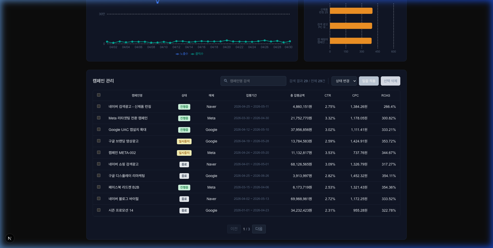
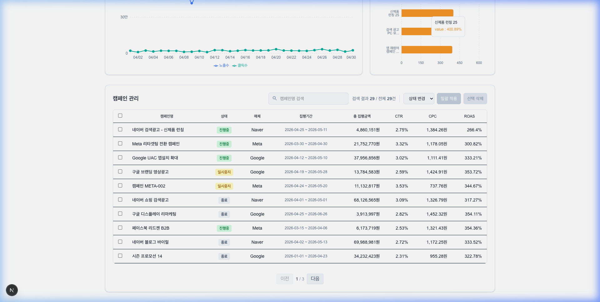

# 🚀 마케팅 캠페인 성과 대시보드

실시간 마케팅 성과를 시각화하고 캠페인을 효율적으로 관리하기 위한 풀스택 웹 애플리케이션입니다.
Next.js(App Router)와 NestJS를 BFF(Backend-for-Frontend) 패턴으로 연결하고, JWT 인증으로 대시보드 전체를 보호합니다.


---

## 📑 목차

1.  [프로젝트 개요](#-프로젝트-개요)
2.  [아키텍처](#-아키텍처)
3.  [기술 스택](#-기술-스택)
4.  [실행 방법](#-실행-방법)
5.  [주요 기능 및 UI](#-주요-기능-및-ui)
6.  [설계 하이라이트](#-설계-하이라이트)
7.  [폴더 구조](#-폴더-구조)

---

## 🎯 프로젝트 개요

원래 `json-server` 목업으로 시작한 프론트엔드 과제를, **실제 프로덕션급 백엔드(NestJS + PostgreSQL)와 JWT 인증**을 갖춘 풀스택 프로젝트로 확장했습니다. 브라우저는 NestJS API를 절대 직접 호출하지 않고, Next.js 서버가 유일한 클라이언트가 되는 BFF 구조를 채택해 JWT가 브라우저 JavaScript에 전혀 노출되지 않도록 설계했습니다.

- 다크/라이트 모드 완전 지원 (차트 툴팁까지 테마 인식)
- httpOnly 쿠키 기반 JWT 인증 — accessToken 15분 / refreshToken 7일, 세션 만료 시 자동 갱신
- 캠페인 목록 조회, 등록, 상태 일괄 변경, 일괄 삭제 — 전부 실제 Postgres 데이터로 동작

> 이 프로젝트는 회원가입 없이 데모 계정 하나를 공유합니다. 캠페인 등록/상태변경/삭제를
> 자유롭게 테스트해 보세요 — 매일 00:00(KST)에 원본 데이터로 자동 초기화됩니다.

---

## 🏗 아키텍처

```
[Browser] --(same-origin httpOnly cookie)--> [Next.js Server] --(Authorization: Bearer JWT)--> [NestJS API] --(Prisma)--> [PostgreSQL]
```

- **브라우저는 NestJS를 직접 호출하지 않습니다.** 로그인 시 발급받은 accessToken/refreshToken을 Next.js가 httpOnly 쿠키로 저장하고, 이후 모든 API 호출은 Next.js 서버(Server Component / Server Action)가 쿠키에서 토큰을 읽어 `Authorization` 헤더로 NestJS에 전달합니다.
- 이 구조 덕분에 JWT가 XSS로 탈취될 경로 자체가 없고, 크로스도메인 쿠키 문제나 CORS 설정도 사실상 불필요합니다.
- `middleware.ts`가 페이지 진입마다 인증 상태를 검사하고, accessToken이 만료됐지만 refreshToken이 살아있으면 사용자가 눈치채지 못하게 자동으로 재발급합니다. Server Action(캠페인 등록/상태변경/삭제) 도중 토큰이 만료되면 그 자리에서 갱신 후 원래 요청을 재시도합니다.

---

## 🛠 기술 스택

### Frontend

| 분류          | 기술                     | 선택 이유                                                   |
| :------------ | :----------------------- | :----------------------------------------------------------- |
| **Framework** | **Next.js 16 (App Router)** | RSC 기반 서버 사이드 페칭, Parallel Routes, Server Actions   |
| **State**     | **Zustand**              | 전역 필터(날짜/상태/매체)의 효율적인 구독 및 동기화           |
| **Style**     | **Tailwind CSS**         | 유틸리티 우선 스타일링 및 다크모드 테마 시스템                |
| **Chart**     | **Recharts**             | 반응형 지원 및 선언적 차트 인터페이스                          |
| **Form**      | **React Hook Form + Zod**| 스키마 기반 유효성 검사, 서버(NestJS DTO)와 규칙 이중화        |

### Backend

| 분류           | 기술                          | 선택 이유                                                  |
| :------------- | :---------------------------- | :---------------------------------------------------------- |
| **Framework**  | **NestJS 11**                 | 모듈 기반 구조, DI, 데코레이터 기반 검증/가드                |
| **ORM**        | **Prisma 7**                  | 타입 안전 쿼리, driver adapter 기반 PostgreSQL 연결          |
| **Database**   | **PostgreSQL 16** (Docker)     | 관계형 데이터(Campaign ↔ DailyStat) 무결성 보장               |
| **Auth**       | **Passport JWT**               | accessToken/refreshToken 이중 발급, 전역 가드로 기본 보호      |
| **Validation** | **class-validator**            | 프론트엔드 zod 스키마와 동일한 규칙을 서버에도 이중 적용        |

---

## 🏃 실행 방법

이 저장소는 **pnpm 워크스페이스가 아닌, `frontend/`와 `server/`가 완전히 독립된 두 프로젝트**로 구성되어 있습니다. 로컬에서 전체를 띄우려면 아래 순서대로 진행하세요.

### 0. 사전 준비

- [Docker Desktop](https://www.docker.com/products/docker-desktop/) 설치 및 실행
- Node.js 20+ / pnpm ([Corepack](https://nodejs.org/api/corepack.html) 권장: `corepack enable && corepack prepare pnpm@latest --activate`)

### 1. 로컬 PostgreSQL 실행

```bash
docker compose up -d
```

### 2. 백엔드(NestJS) 설정 및 실행

```bash
cd server
cp .env.example .env   # DATABASE_URL, ADMIN_EMAIL/PASSWORD, JWT_SECRET 등 채워넣기
pnpm install
npx prisma migrate dev   # 테이블 생성
npx prisma db seed       # db.json → Postgres 시딩 (캠페인 80개 + admin 계정)
pnpm run start:dev       # http://localhost:3001
```

### 3. 프론트엔드(Next.js) 실행

```bash
cd frontend
pnpm install
pnpm dev                 # http://localhost:3000
```

### 4. 로그인

`http://localhost:3000`에 접속하면 `/login`으로 리다이렉트됩니다. `server/.env`에 설정한 `ADMIN_EMAIL`/`ADMIN_PASSWORD`로 로그인하세요.

---

## ✨ 주요 기능 및 UI

### 1. 데이터 시각화 대시보드

일별 추이, 매체별 성과, 우수 캠페인을 직관적으로 파악할 수 있습니다. 차트 hover 툴팁까지 다크/라이트 테마를 인식합니다.

|                 다크 모드 (Dark)                  |                 라이트 모드 (Light)                 |
| :-----------------------------------------------: | :-------------------------------------------------: |
|  |  |

### 2. 캠페인 관리 테이블

상태 변경, 일괄 삭제, 실시간 검색 등 관리 기능을 제공하며, 모든 변경은 실제 Postgres에 반영됩니다.

|                 캠페인 관리 (Dark)                 |                 캠페인 관리 (Light)                  |
| :------------------------------------------------: | :--------------------------------------------------: |
|  |  |

### 3. 인증

단일 관리자 로그인으로 대시보드 전체를 보호합니다. 로그인하지 않은 상태로 어떤 경로에 접근해도 `/login`으로 리다이렉트되며, 세션 중 accessToken이 만료돼도 사용자는 재로그인 없이 계속 작업할 수 있습니다.

---

## 💡 설계 하이라이트

### httpOnly 쿠키 + BFF — XSS로부터 완전 격리된 토큰 저장

JWT를 `localStorage`나 일반 쿠키가 아닌 httpOnly 쿠키로만 다뤄서 JavaScript가 토큰에 접근할 방법 자체를 없앴습니다. 이걸 가능하게 하려고 프론트엔드가 API 클라이언트를 컨텍스트별로 분리했습니다: RSC(`serverFetch`)는 쿠키를 읽기만 하고, Server Action(`actionFetch`)은 쿠키를 쓸 수 있으므로 401을 받으면 그 자리에서 refreshToken으로 갱신 후 재시도합니다. Next.js의 RSC는 쿠키 쓰기가 금지되어 있다는 제약을 그대로 반영한 설계입니다.

### 프론트/백엔드 이중 유효성 검사

`features/campaign/schemas/campaignFormSchema.ts`의 zod 규칙(이름 2~100자, 예산 100~10억원, 종료일 > 시작일)을 NestJS DTO의 class-validator 데코레이터에도 그대로 반영했습니다. 클라이언트 검증을 우회해 직접 API를 호출해도 동일한 규칙이 서버에서 다시 강제됩니다.

### 지저분한 실데이터에 대한 정규화

시딩 대상 `db.json`에는 `platform: "네이버"/"facebook"/"Facebook"`, `status: "running"/"stopped"` 같은 비정형 값과 `budget: "2000000원"`처럼 타입이 섞인 필드가 실제로 존재합니다. 프론트엔드에 이미 이런 값을 표준값(`Google`/`Naver`/`Meta`, `active`/`paused`/`ended`)으로 정규화하는 유틸(`shared/utils/dataset.ts`)이 있다는 걸 확인하고, 백엔드 시딩 스크립트에도 동일한 정규화 규칙을 그대로 미러링해서 프론트-백엔드 간 데이터 해석이 어긋나지 않도록 했습니다.

### Parallel Routes로 체감 성능 확보

Recharts는 번들 크기가 크고 초기 렌더 연산량이 많습니다. `@charts`/`@table` Parallel Routes로 두 영역을 독립적으로 로딩해서, 무거운 차트가 준비되는 동안에도 나머지 레이아웃이 먼저 사용자에게 노출되도록 했습니다.

### no-store 전략

모든 데이터 페칭에 캐싱보다 정확성을 우선하는 `no-store` 전략을 적용했습니다. 캠페인 상태를 변경하거나 새로 등록한 직후에도 항상 최신 Postgres 데이터를 보장합니다.

### 매직 넘버 중앙 관리

컴포넌트 내부에 흩어져 있던 하드코딩 수치(예산 한도, 페이지 크기, 차트 색상 등)를 `shared/constants/`로 모아, 정책이 바뀌어도 한 곳만 수정하면 되도록 구조화했습니다.

---

## 📂 폴더 구조

```
marketing-dashboard/
├── frontend/               # Next.js 앱 (Vercel 배포 대상)
│   ├── app/                # 라우팅 (auth 미들웨어, (dashboard) 라우트 그룹)
│   ├── features/           # 도메인별 캡슐화 (campaign, dashboard, filter, auth)
│   └── shared/              # 공용 컴포넌트, 유틸, 타입, api-client
├── server/                 # NestJS API (Railway/Render 배포 대상)
│   ├── src/
│   │   ├── auth/            # JWT 로그인/리프레시, 전역 가드
│   │   ├── campaigns/       # 캠페인 CRUD
│   │   ├── daily-stats/     # 일별 통계 조회
│   │   └── prisma/          # PrismaService
│   └── prisma/schema.prisma
├── docker-compose.yml       # 로컬 개발용 PostgreSQL
├── db.json                  # 시딩 소스 데이터 (80 캠페인 / 1,422 daily stats)
└── docs/                    # 구현 계획 및 설계 문서
```
